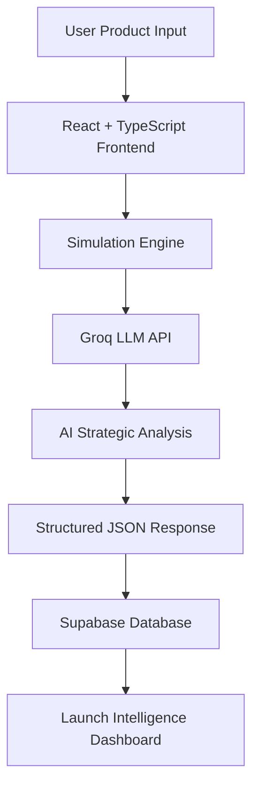

# LaunchIQ.ai

## AI-Powered Product Launch Intelligence Platform

> Predict product launch success before going to market using AI-powered strategic consulting intelligence.

**Live Platform:**  
https://launch-iq-ai.vercel.app/

**Product Demo:**  
https://drive.google.com/file/d/1_RsbBekWaEKZ1L8vRRmYzNKCSje6Rkrt/view?usp=drivesdk

**Deployment Status:** Production Ready

---

# Product Overview

| Category | Details |
|----------|----------|
| **Product Name** | LaunchIQ.ai |
| **Category** | AI Product Launch Intelligence Platform |
| **Domain** | Product Strategy • Business Intelligence • Artificial Intelligence |
| **Project Type** | Full Stack AI SaaS Application |
| **Deployment** | Publicly Accessible (Vercel) |
| **Status** | Live & Production Ready |

---

# Problem Statement

Businesses often launch products with limited understanding of:

- Customer purchase intent
- Market sentiment
- Pricing effectiveness
- Competitive positioning
- Launch risk
- Go-To-Market readiness

This uncertainty frequently leads to:

❌ Failed product launches  
❌ Weak product-market fit  
❌ Poor pricing decisions  
❌ Ineffective market positioning  
❌ High launch risk  

---

# Solution

LaunchIQ.ai is an **AI-powered Product Launch Intelligence Platform** designed to simulate the success potential of products **before market launch**.

Instead of relying on assumptions, LaunchIQ.ai generates:

- Purchase likelihood prediction  
- Launch risk analysis  
- Market sentiment intelligence  
- Executive strategic summaries  
- Competitive positioning recommendations  
- Pricing strategy insights  
- Go-To-Market recommendations  
- SWOT-based launch intelligence  

using **Large Language Models (LLMs)** and structured business intelligence workflows.

---

# Target Users

## Primary Users

- Product Managers
- Product Analysts
- Business Analysts
- Founders & Entrepreneurs
- D2C Brands
- Product Strategy Teams
- Innovation Teams
- Consulting Professionals

## Secondary Users

- Startups
- Growth Teams
- Market Research Teams
- AI Product Teams
- Product Consultants

---

# Product Objective

Enable businesses and product teams to evaluate the success potential of products **before launch** through AI-powered launch intelligence simulations.

---

# Public Product Access

LaunchIQ.ai is now publicly deployed and accessible.

### Live Product

https://launch-iq-ai.vercel.app/

Users can:

- Create product launch simulations  
- Analyze launch risk  
- Predict market sentiment  
- Evaluate pricing strategies  
- Benchmark competitors  
- Generate SWOT insights  
- Receive AI-powered launch recommendations  

from any device.

---

# User Inputs

Users provide:

| Input | Description |
|--------|-------------|
| Product Name | Product/brand name |
| Category | Product category |
| Industry | Industry domain |
| Target Audience | Intended customer segment |
| Price | Product pricing |
| Market Region | Launch geography |
| Product Features | Product differentiators |
| Competitors | Existing competitors |
| Launch Goal | Strategic launch objective |

---

# AI Outputs

LaunchIQ.ai generates:

## Intelligence Metrics

- Purchase Likelihood
- Launch Risk Score
- Market Sentiment
- Confidence Score

## Strategic Intelligence

- Executive Summary
- Strategic Insights
- Market Risks
- Pricing Strategy
- Competitive Positioning
- Go-To-Market Strategy
- SWOT Intelligence
- AI Recommended Actions

---

# System Architecture



---

# Tech Stack

## Frontend

```txt
React
TypeScript
Vite
Tailwind CSS
shadcn/ui
React Router
```

## Backend & Database

```txt
Supabase
PostgreSQL
Authentication
Database Persistence
```

## AI Intelligence

```txt
Groq API
Llama 3.3 70B Versatile
Prompt Engineering
Structured JSON Parsing
Strategic Consulting Intelligence
```

## Hosting & Deployment

```txt
Vercel
GitHub
```

---

# Supported Industry Simulations

LaunchIQ.ai supports product launch intelligence across:

```txt
Healthcare
Beauty & Personal Care
Luxury Products
Consumer Electronics
Automotive / EV
FinTech
SaaS
D2C Products
Smart Devices
AI Products
Healthcare Technology
```

---

# ✨ Key Features

### AI Consulting Intelligence
Generate McKinsey/Bain-style launch recommendations.

### Strategic Market Analysis
Analyze competitive pressure and launch feasibility.

### Pricing Intelligence
Evaluate premium vs value-based pricing.

### Market Risk Detection
Identify major launch threats before launch.

### SWOT Intelligence
Automatically generate strengths, weaknesses, opportunities, and threats.

### Persistent Simulations
Store simulations securely using Supabase.

### Real-time Results Dashboard
Premium UI for AI-generated launch intelligence.

---

# 🎥 Product Demonstration

### Quick Product Demo

https://drive.google.com/file/d/1_RsbBekWaEKZ1L8vRRmYzNKCSje6Rkrt/view?usp=drivesdk

Demo includes:

- Landing page walkthrough  
- Product simulation flow  
- AI-generated strategic outputs  
- Market intelligence insights  
- Launch recommendation engine  
- Supabase integration  

---

# 🎯 Project Goal

Build a recruiter-impressive AI product portfolio project demonstrating:

- Product Thinking  
- Business Intelligence Capability  
- AI Integration Expertise  
- Full Stack Engineering  
- Strategic Consulting Mindset  
- End-to-End Product Execution  
- Product Management Problem Solving

---

# 📈 Current Status

```txt
Frontend Development       Complete
Groq AI Integration        Complete
Supabase Integration       Complete
Launch Intelligence UI     Complete
Simulation Engine          Complete
Testing                    Complete
Production Deployment      Complete
Public Access              Live
```
