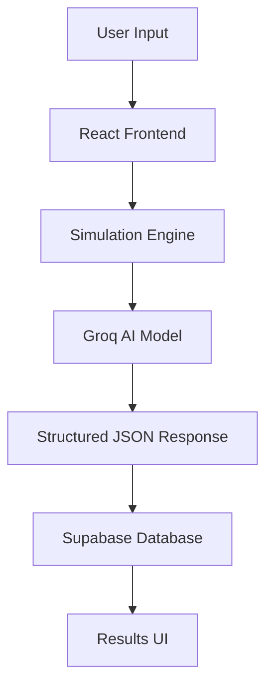
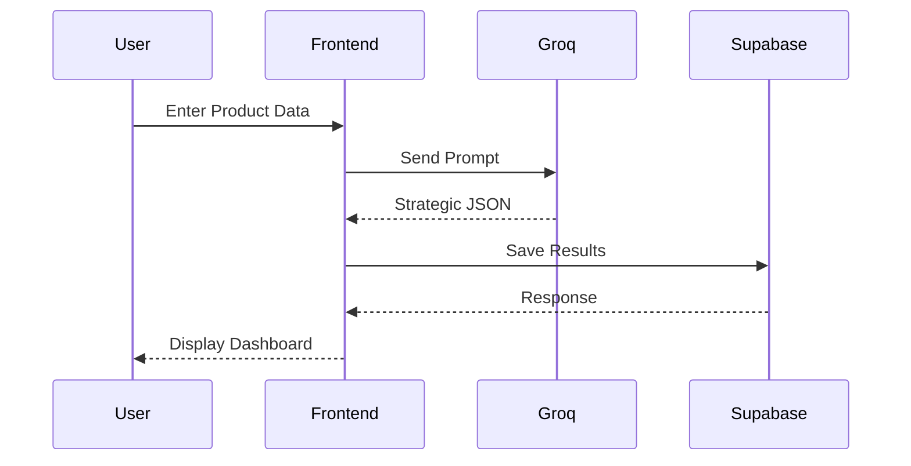

# LaunchIQ.ai System Architecture

## Full Stack Architecture

---

## System Components

### Frontend Layer

- React
- TypeScript
- Tailwind CSS
- shadcn/ui

### Intelligence Layer

- Groq API
- Llama 3.3 70B
- JSON Response Handling

### Persistence Layer

- Supabase Auth
- PostgreSQL Database

---

## Request Flow

