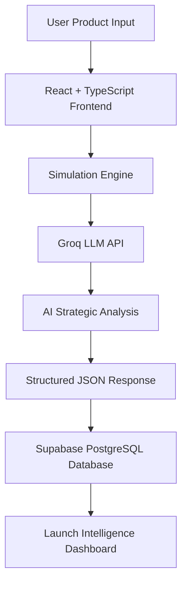
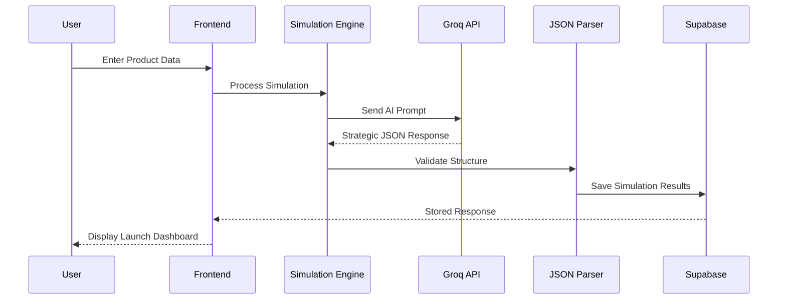

# System Architecture

> Full-stack AI-powered product launch intelligence architecture powered by **React + Groq LLM + Supabase**

**Live Platform:**  
https://launch-iq-ai.vercel.app/

**Product Demo:**  
https://drive.google.com/file/d/1_RsbBekWaEKZ1L8vRRmYzNKCSje6Rkrt/view?usp=drivesdk

**Deployment Status:** Production Ready

---

# Full Stack Architecture



---

# System Components

## Frontend Layer

Responsible for user interaction and simulation experience.

### Technologies Used

```txt
React
TypeScript
Vite
Tailwind CSS
shadcn/ui
React Router
```

### Responsibilities

- Product simulation forms
- Authentication flow
- Dashboard rendering
- Strategic output visualization
- Real-time user interaction
- Responsive UI experience

---

## Intelligence Layer

Responsible for AI-powered business intelligence generation.

### Technologies Used

```txt
Groq API
Llama 3.3 70B Versatile
Prompt Engineering
Structured JSON Parsing
```

### Responsibilities

- Product launch simulation
- Purchase likelihood prediction
- Launch risk assessment
- Market sentiment intelligence
- Strategic recommendations
- Pricing strategy generation
- Competitive positioning
- Go-To-Market recommendations
- SWOT intelligence

---

## Persistence Layer

Responsible for secure data storage and retrieval.

### Technologies Used

```txt
Supabase Authentication
PostgreSQL Database
Database Persistence
Session Management
```

### Responsibilities

- User authentication
- Simulation storage
- Dashboard persistence
- Historical records
- Session handling

---

# Request Flow Architecture



---

# Data Flow

### Step 1 — User Input
Users enter:

- Product Name
- Category
- Industry
- Target Audience
- Pricing
- Product Features
- Competitors
- Launch Goal
- Market Region

### Step 2 — AI Processing
LaunchIQ.ai sends structured prompts to:

```txt
Groq LLM (Llama 3.3 70B Versatile)
```

for strategic launch intelligence.

### Step 3 — Response Structuring
AI responses are transformed into structured JSON outputs.

### Step 4 — Database Storage
Simulation results are stored securely in:

```txt
Supabase PostgreSQL
```

### Step 5 — Dashboard Generation
Users receive:

- Purchase likelihood  
- Launch risk score  
- Market sentiment  
- Executive strategic summary  
- Pricing recommendations  
- Competitive positioning  
- SWOT analysis  
- Go-To-Market strategy  

---

# Infrastructure Stack

| Layer | Technology |
|-------|-------------|
| Frontend | React + TypeScript |
| UI Styling | Tailwind CSS |
| UI Components | shadcn/ui |
| Routing | React Router |
| AI Intelligence | Groq LLM |
| AI Model | Llama 3.3 70B |
| Backend | Supabase |
| Database | PostgreSQL |
| Deployment | Vercel |
| Version Control | GitHub |

---

# Architecture Status

```txt
Frontend Architecture       Complete
AI Intelligence Layer       Complete
Database Persistence        Complete
Authentication System       Complete
Simulation Engine           Complete
Strategic Output Engine     Complete
Production Deployment       Complete
Public Access               Live
```
